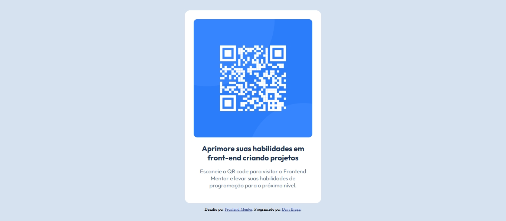

# Frontend Mentor - Solução do desafio do QR code

Esta é uma solução para o desafio do [QR Code no Frontend Mentor](https://www.frontendmentor.io/challenges/qr-code-component-iux_sIO_H). Os desafios do Frontend Mentor ajudam você a melhorar suas habilidades de programação construindo projetos reais.

## Sumário

- [Visão geral](#visão-geral)
  - [Screenshot](#screenshot)
  - [Links](#links)
- [Meu processo](#meu-processo)
  - [Recursos utilizados](#recursos-utilizados)
  - [O que eu aprendi](#o-que-eu-aprendi)
- [Autor](#autor)

## Visão geral

Este projeto é a minha solução para o desafio QR Code Component do Frontend Mentor. O objetivo era recriar um componente simples e responsivo contendo um QR Code, aplicando conceitos básicos de _HTML_ e _CSS_. Como é um dos meus primeiros projetos no desenvolvimento web, ele serviu como uma ótima oportunidade para praticar estruturação de página, centralização de elementos e estilização com _CSS_. O resultado final reflete meu aprendizado inicial e minha evolução na construção de componentes visuais limpos e organizados.

### Screenshot

### Links

- Link do meu repositório: [Repositório](https://github.com/Davigalo13/desafio01-qrcode)
- Link do resultado final: [Resultado final](https://davigalo13.github.io/desafio01-qrcode/)

## Meu processo

### Recursos utilizados

- **HTML5** — para estruturar o conteúdo da página.
- **CSS3** — para estilização do componente, incluindo layout, cores, espaçamentos e responsividade básica.
- **Google Fonts** — para aplicar tipografia personalizada ao projeto.

### O que eu aprendi

Neste projeto, pude reforçar meus conhecimentos em estruturação com _HTML_ e estilização com _CSS_, especialmente para centralizar e organizar elementos na tela. Também aprendi a trabalhar melhor com unidades relativas, bordas, espaçamentos e alinhamentos, garantindo que o componente ficasse visualmente equilibrado. Além disso, tive meu primeiro contato com a integração de Google Fonts, entendendo como aplicar tipografia personalizada de forma simples. No geral, este desafio me ajudou a ganhar mais confiança na construção de componentes responsivos e bem estruturados.

## Autor

- GitHub - [Davigalo13](https://github.com/Davigalo13)
- Frontend Mentor - [@Davigalo13](https://www.frontendmentor.io/profile/Davigalo13)
- Instagram - [@davis_braga](https://www.instagram.com/davis_braga/)
